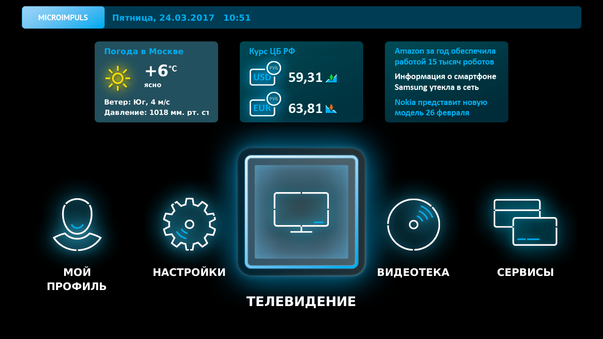

Подключение
===========

Первое включение. Активация
---------------------------

Главное меню, список пунктов меню, краткое описание каждого пункта
------------------------------------------------------------------

Главное меню используется для быстрого доступа к основным разделам интерфейса, а так же может содержать дополнительные приложения и информационные плагины (погодный, курсов валют и т.д.).

Перейти в главное меню можно из любого экрана интерфейса по нажатию кнопки **MENU**.

Навигация осуществляется с помощью кнопок **ВЛЕВО/ВПРАВО**. Для перехода к выбранному разделу нажмите кнопку **ОК**. Кнопки **ВВЕРХ/ВНИЗ** используются для переключения между списками главного меню и дополнительных приложений и плагинов.

Разделы главного меню предоставляют следущие возможности:

    Телевидение
        список доступных каналов, программа передач, поиск передач, доступ к архивным передачам, установка напоминаний
    Видеотека
        список фильмов, поиск и покупка фильмов, просмотр трейлеров и фильмов
    Сервисы
        доступ к дополнительным услугам - просмотр видео с YouTube, прослушивание радио и т.д.
    Мой профиль
        баланс текущего аккаунта с детализацией по разным услугам, список сообщений от оператора, список напоминаний о передачах
    Настройки
        возможность задать пользовательскую сортировку каналов, выбор языка интерфейса, настройки родительского контроля, информация об устройстве