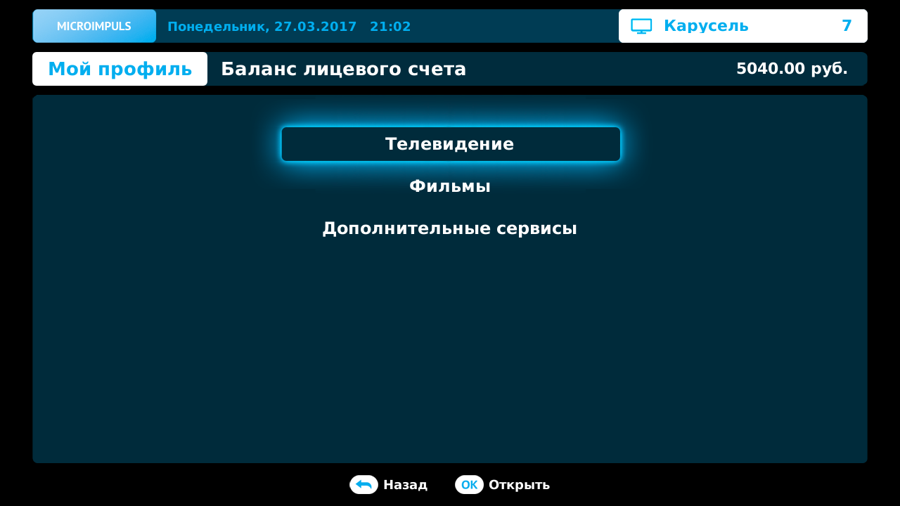
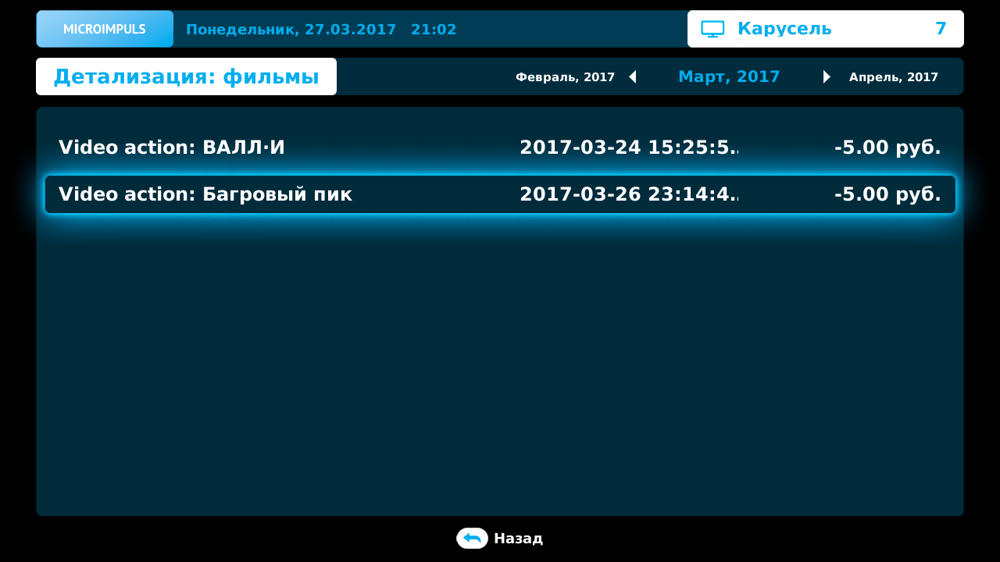
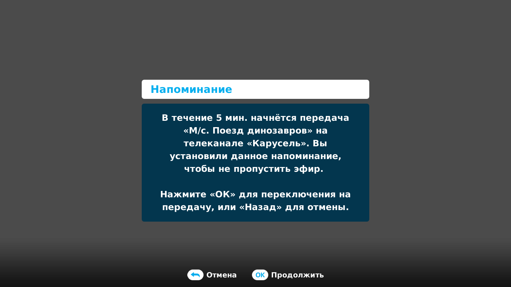
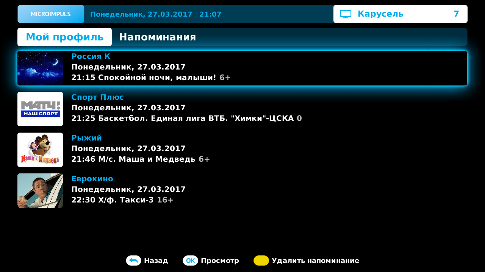

Мой профиль
===========

Просмотр Баланса
----------------

В разделе Мой профиль доступна возможность просмотра информации о пополнениях и расходах по текущему лицевому счету. Для доступа к данным выполните переход Главное меню > Мой профиль > Баланс лицевого счета. Детализация делится на несколько видов, по типу услуг:

* Телевидение - поступления и расходы по услугам Телевидения
* Фильмы - расходы на аренду фильмов из Видеотеки
* Дополнительние сервисы - расходы на подключенные дополнительные сервисы, которые предоставляются за отдельную плату

Чтобы перейти к просмотру списка операций выберите интересующую категорию и нажмите **ОК**.

При открытии экрана показывается список за текущий месяц, для перехода к другому месяцу испольуйте кнопки **ВЛЕВО/ВПРАВО**. Информация о выбранном месяце отображается над списком операций. Сам список представляет собой таблицу из трех колонок: тип операции с дополнительными сведениями, дата пополнения/списания, сумма пополнения/списания. Операции в списке отсортированы по дате по нарастанию, то есть первой в списке будет самая первая операция выбранного месяца.

Напоминания
-----------

Напоминания помогают не пропустить интересные передачи. Добавить в Напоминания можно только передачу, которая еще не началась.

Функционал добавления напоминания для передачи доступен в нескольких экранах:

* Телепрограмма
* Описание передачи
* В списке результатов поиска передачи

Для добавления напоминания нажмите **ЖЕЛТУЮ КНОПКУ**. Повторное нажатие **ЖЕЛТОЙ КНОПКИ** удалит уже добавленное напоминание.

Если просматриваемый канал отличается от того, на котором должна начаться ожидаемая передача, то за пять минут до ее начала появится всплывающее информационное окно с предложением перейти на канал передачи.

Для управления напоминаниями перейдите Главное меню > Мой профиль > Напоминания, в этом экране содержится список всех добавленных передач.

Чтобы удалить передачу из списка, выберите ее и нажмите **ЖЕЛТУЮ КНОПКУ**. После чего появится окно с запросом на подтверждение, в случае согласия напоминание будет удалено.

Архив сообщений
---------------

Архив сообщений это список уведомлений и информационных сообщений от оператора. В них может содержаться информация о состоянии счета, о технических или профилактических работах, о специальных акциях и предложениях и т.д.

Чтобы открыть Архив сообщений перейдите Главное меню > Мой профиль > Архив сообщений.

Экран Архив сообщений это список полученных сообщений. Список представлен в виде таблицы с тремя колонками: дата отправки, тема сообщения и иконка статуса в виде конверта, если сообщение еще не прочитано. Для навигации по списку сообщений используйте кнопки **ВВЕРХ/ВНИЗ**.

Чтобы прочитать сообщение нажмите **OK**. После прочтения у сообщения больше не будет отображаться иконка в виде конверта.

Сразу по прочтении сообщения его можно удалить **ЖЕЛТОЙ КНОПКОЙ**, либо закрыть без удаления нажав кнопку **BACK**.

Чтобы удалить все сообщения, откройте их список и нажмите **ЖЕЛТУЮ КНОПКУ**.