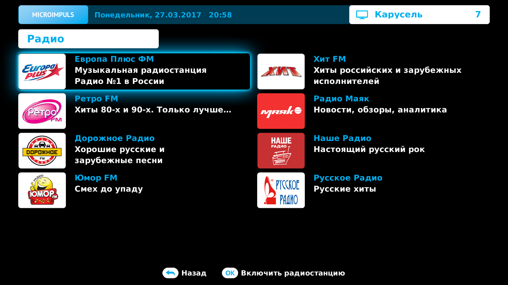

Сервисы
=======

Youtube
-------
Описание
~~~~~~~~
Как пользоваться
~~~~~~~~~~~~~~~~
Радио
-----
Описание
~~~~~~~~

Сервис Радио предоставляет возможность прослушивания радиостанций через интерфейс. Открыть список радиостанций можно следующим образом: Главное меню > Сервисы > Радио.

Как пользоваться
~~~~~~~~~~~~~~~~

В списке радиостанций для навигации используйте кнопки **ВВЕРХ/ВНИЗ/ВЛЕВО/ВПРАВО**, при этом кнопки **CH+/CH-** дублируют поведение кнопок **ВВЕРХ/ВНИЗ**. Кнопки **ПЕРЕМОТКИ ВПЕРЕД/НАЗАД** используются для перехода вперед/назад на n-элементов, где n — это количество отображаемых на экране станций.

Чтобы запустить воспроизведение выбранной станции нажмите кнопку **ОК**. Если при этом в фоне проигрывается прямой эфир/запись передачи/видео из Видеопроката, видеопоток будет остановлен.

Чтобы остановить Радио нажмите кнопку **STOP**. Так же воспроизведение остановится само в случае запуска просмотра прямого эфира/записанных передач/видео из Видеопроката.