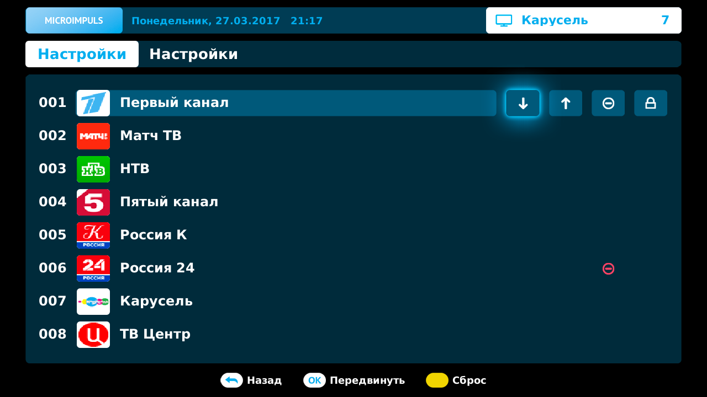
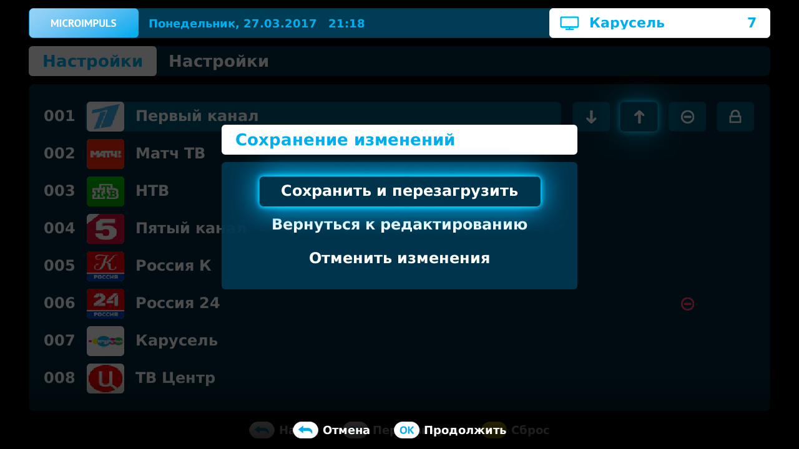
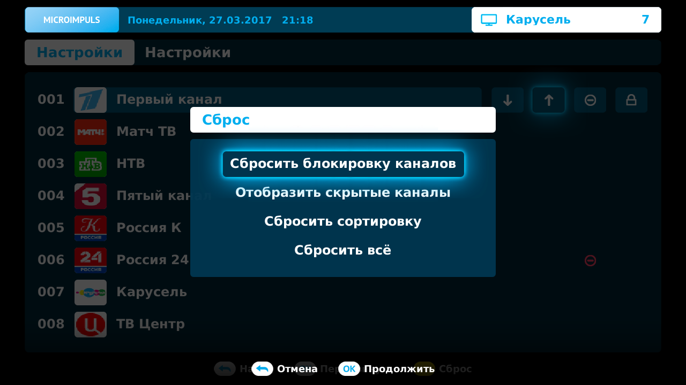
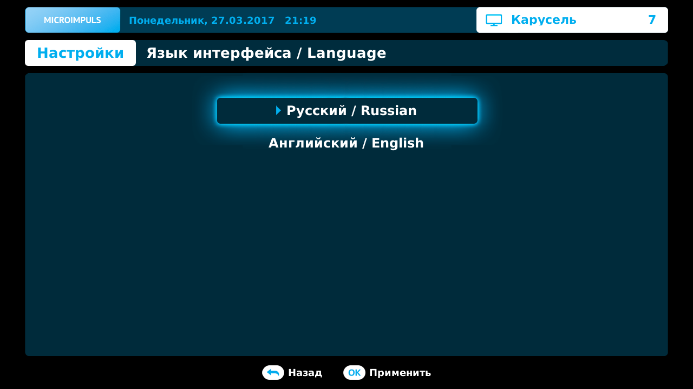
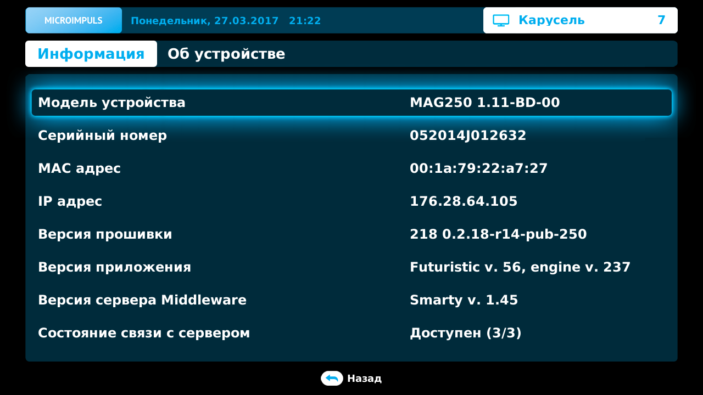
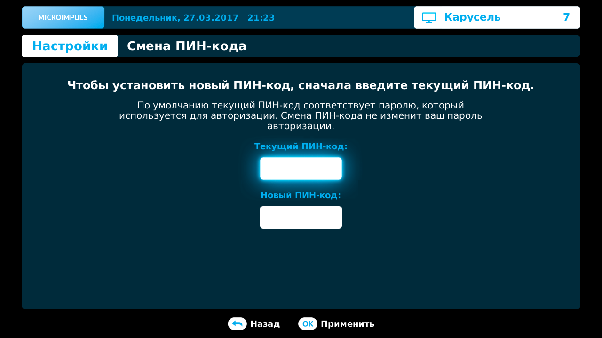

Настройки
=========

Сортировка блокировка каналов
------------------------------

В интерфейсе есть возможность задать свой порядок сортировки каналов, скрыть канал или установить для него запрос ПИН-кода. Для этого следует перейти *Главное меню* > *Настройки* > *Сортировка каналов*.

В списке каналов кнопки доступных действий появляются рядом с выделенной строкой. Для переключения между каналами используйте кнопки **ВВЕРХ/ВНИЗ**, для переключения между действиями - кнопки **ВЛЕВО/ВПРАВО**. Чтобы применить выбранное действие нажмите **ОК**.

Доступные действия над списком как они расположены слева направо:

* Перемещение канала вниз по списку
* Перемещение канала вверх по списку
* Скрыть/показать канал - если скрыть канал, то он больше не будет отображаться в списке каналов в меню *Телевидение*, но будет доступен в списке сортировки данного экрана. У скрытого канала, отображается подсвеченная иконка действия, даже если фокус установлен не на нем.
* Установить запрос ПИН-кода на канал - при попытке воспроизведения такой канал будет рассматриваться как канал для взрослых, и его воспроизведение может быть ограничено в зависимости от настроек доступа к каналам для взрослых (см. :ref:`parent-control-label`). У такого канала, отображается подсвеченная иконка действия, даже если фокус установлен не на нем.

После применения действий, чтобы они вступили в силу необходимо перезагрузить интерфейс. Для этого нажмите кнопку **BACK** и в появившемся меню выберите *Сохранить и перезагрузить*. Если перед сохранением необходимы дополнительные изменения, выберите *Вернуться к редактированию* или просто нажмите кнопку **BACK**. Если нет необходимости сохранять изменения выберите *Отменить изменения*.

Для того, чтобы сбросить все когда-либо примененные пользовательские настройки для списка нажмите **ЖЕЛТУЮ КНОПКУ**. Появится меню, в котором можно выбрать какие настройки списка необходимо сбросить (блокировка, скрытие, сортировка каналов). Чтобы отменить абсолютно все настройки выберите *Сбросить всё*.

Выбор языка
-----------

Для интерфейса можно выбрать язык, на котором будут отображаться все его элементы. Для этого перейдите *Главное меню > Настройки > Язык интерфейса / Language*, в списке будут отображены доступные для применения языки.

Чтобы применить выбранный язык нажмите **ОК**.

.. _parent-control-label:

Ограничение доступа/родительский контроль
-----------------------------------------

В интерфейсе предусмотрен функционал для ограничения доступа к нежелательному контенту. Переход к его настройкам: *Главное меню > Настройки > Ограничение доступа*. При входе в этот экран будет запрошен ввод ПИН-кода, по умолчанию ПИН-кодом является код для авторизации в интерфейсе.

В экране предусмотрены два типа ограничений:

* Доступ к каналам для взрослых - предоставляет на выбор три уровня доступа:

    * Доступ разрешен - доступ к взрослым каналам ничем не ограничен
    * Просмотр по ПИН-коду - при переключении на взрослый канал будет запрошен ПИН-код, и в случае правильного ввода начнется воспроизведение
    * Доступ запрещен - воспроизведение взрослых каналов запрещено и при переключении на такие каналы выдается только информационное сообщение о запрете

    .. image:: img/settings-parent-control.png

* Доступ к покупке контента - так же имеет три уровня доступа:

    * Оплата контента без ПИН-кода - при оплате контента (например в *Видеотека*), оплата произойдет только по запросу подтверждения действия
    * Оплата контента по ПИН-коду - при оплате контента после запроса на подтверждение действия, будет запрошен ввод ПИН-кода, и только при его правильном вводе покупка будет совершена
    * Покупка контента запрещена - при попытке оплаты контента будет выдано информационное сообщение о запрете на операцию, и покупка не будет совершена

    .. image:: img/settings-content-control.png

Информация об устройстве
------------------------

Для получения информации об устройстве и используемом программном обеспечении перейдите: *Главное меню > Настройки > Информация об устройстве*. Данные этого экрана могут быть полезны при решении возникших проблем.

Экран содержит информацию:

* Модель устройства
* Серийный номер
* MAC адрес
* IP адрес
* Версия прошивки
* Версия приложения
* Версия сервера Middleware
* Состояние связи с сервером

Смена ПИН-кода
--------------

При необходимости смены ПИН-кода необязательно обращаться к оператору, для этого перейдите: *Главное меню > Настройки > Ограничение доступа > Смена ПИН-кода*. Чтобы поменять ПИН-код необходимо знать свой текущий ПИН.

В открывшемся экране введите в первое поле ввода свой текущий ПИН-код, а во второе новый, после чего нажмите **ОК**.

