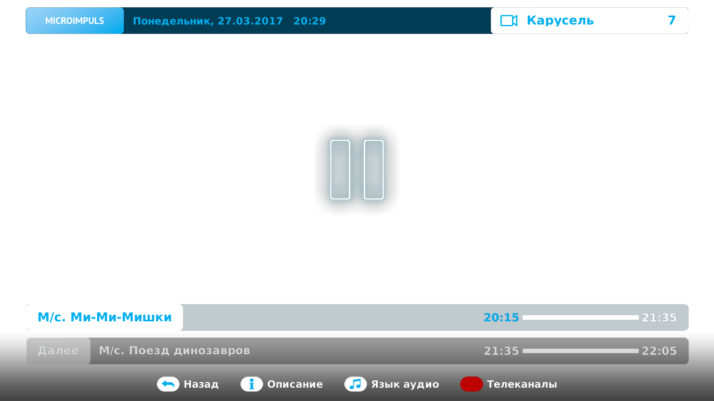

Запись
======

Краткое описание функционала
----------------------------

Интерфейс предоставляет возможность просматривать архивные передачи, а так же ставить прямой эфир на паузу.

Архивные передачи - это передачи, которые уже прошли, но для них имеется возможность просмотра в записи. Записи передач канала доступны на несколько дней назад.

Установка прямого эфира на паузу - позволяет остановить воспроизведение текущей передачи, и возобновить просмотр с места остановки в дальнейшем.

Чтобы воспользоваться функционалом в режиме полноэкранного просмотра нажмите кнопку **PAUSE**, чтобы продолжить просмотр после паузы нажмите **PAUSE** или **PLAY**. Для возврата к прямому эфиру нажмите **STOP**.

Как выбрать передачи для просмотра в записи
-------------------------------------------

Есть несколько способов выбрать записанную передачу:

* Из списка Телепрограммы - передачи, для которых доступна запись отмечены специальным значком рядом с названием передачи.

    .. image:: img/epg-list.png

* Из экрана описания передачи канала - если в описании передачи напротив ее названия отображается значок play, то у этой передачи есть возможность просмотра в записи.

    .. image:: img/program-info-with-record.png

* Из экрана поиска по передачам - поиск происходит как по текущим, так и прошедшим передачам, поэтому некоторые из них могут быть доступны только в записи, об этом сигнализирует значок play.

    .. image:: img/search-results.png

Чтобы начать просмотр выбранной передачи нажмите **ОК**.

.. _actions-in-timeshift-label:

Возможные действия при просмотре в записи
-----------------------------------------

В режиме просмотра записи доступны следующие действия:

* Просмотр описания - нажмите кнопку **INFO**, чтобы открыть экран с подробным описанием передачи.
* Перемотка в обоих направлениях - для этих целей используйте кнопки **ПЕРЕМОТКИ**, а так же кнопки **ВЛЕВО/ВПРАВО**. При этом в отдельном блоке отображается время перемотки. В случае перемотки на время болшее чем текущее, воспроизведение записи останавливается, и начинается трансляция прямого эфира. В случае перемотки за пределы записи, но на время меньшее чем текущее воспроизведение записи продолжается, меняется только информация о передаче.
* Пауза воспроизведения - для этого нажмите кнопку **PAUSE**. Чтобы продолжить просмотр нажмите кнопки **PAUSE** или **PLAY**.
* Возвращение к просмотру прямого эфира - используйте кнопку **STOP**.