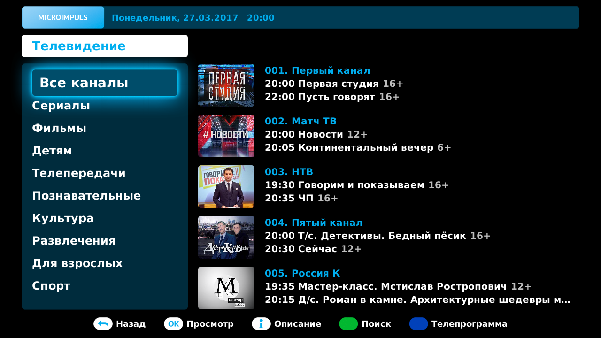
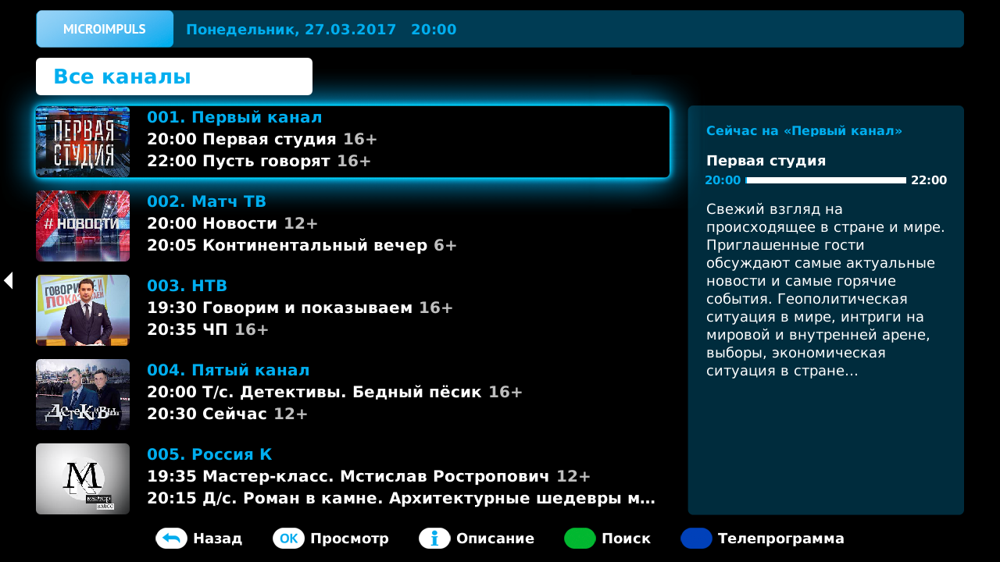
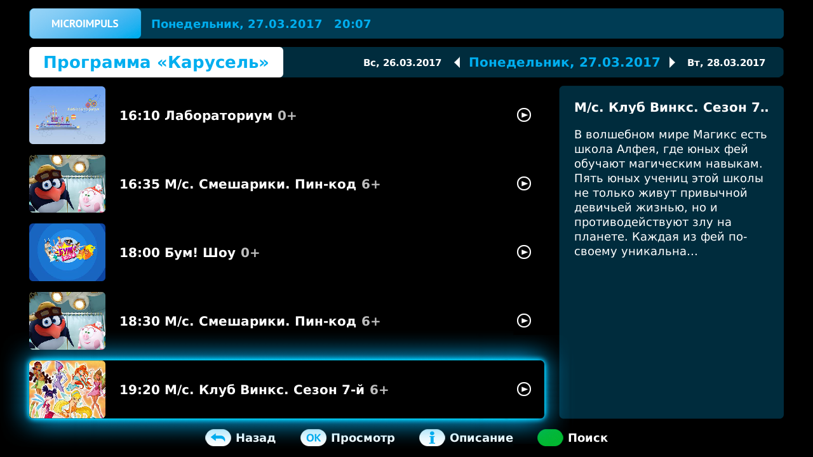
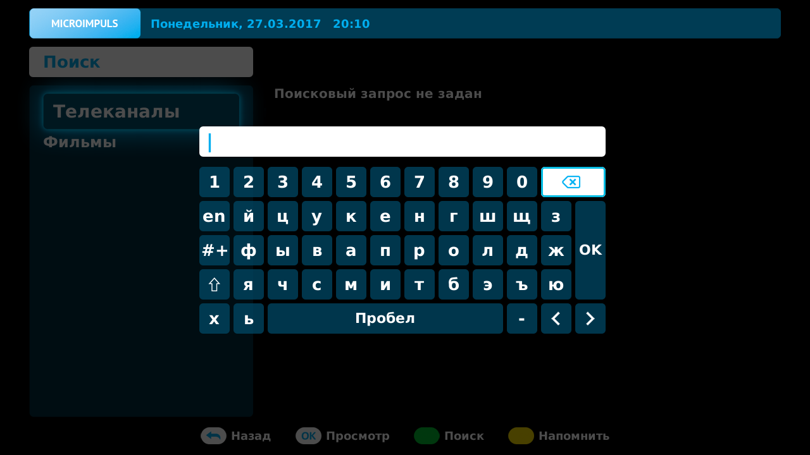
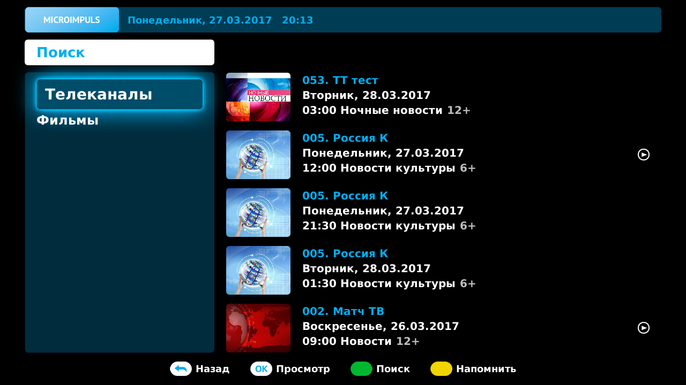
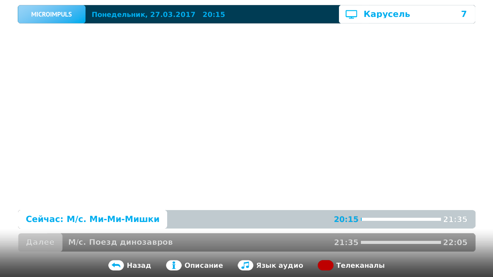
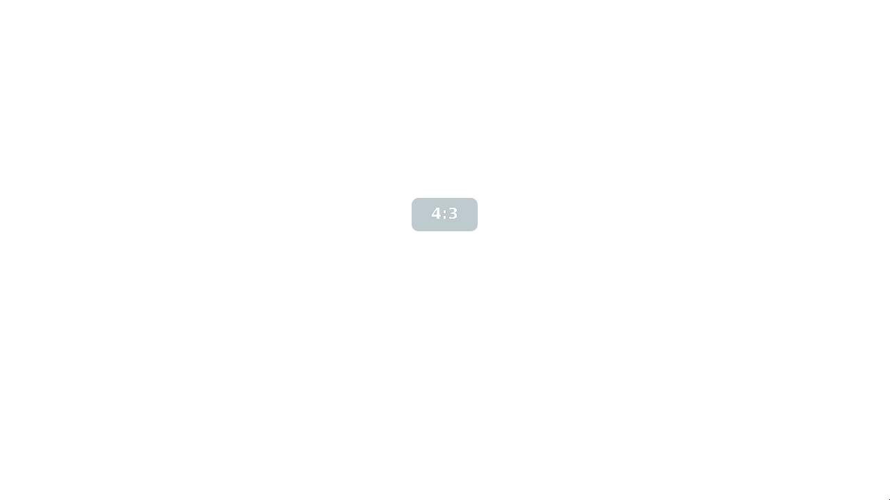
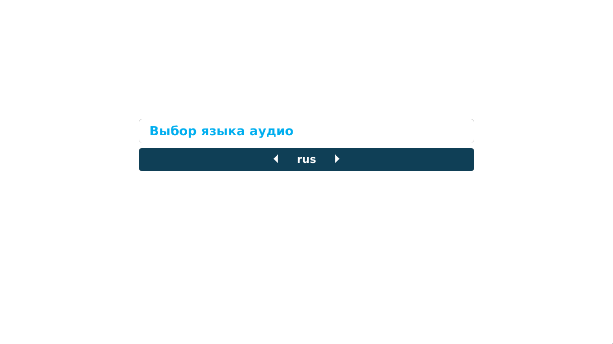

Телевидение
===========

Как попасть в меню ТВ
---------------------

Для перехода в список каналов существует несколько способов:

* *Главное меню > Телевидение*
* По нажатию **КРАСНОЙ КНОПКИ** в любом экране интерфейса
* По нажатию кнопки **TV** в любом экране интерфейса
* По нажатию кнопки **ОК** в режиме полноэкранного просмотра

Описание меню, описание жанров
------------------------------

Меню ТВ состоит из нескольких частей:

* Список категорий
* Список каналов
* Блок описания текущей передачи выбранного канала

В зависимости от выбранного списка внешний вид меню меняется. Если активен список категорий, то описание передачи будет скрыто.

Если активен список каналов, то скроется список категорий.

Разбиение каналов по категориям происходит на основе категории текущей передачи, то есть если на Первом канале сейчас идет сериал, то он попадет в категорию «Сериалы». По мере смены передач на канале, канал может попадать в разные категории. Категория «Все каналы» включает в себя полный список каналов доступных абоненту, вне зависимости от категории передач.

Навигация по меню
-----------------

Меню ТВ состоит из двух списков - список категорий и список каналов. Для того чтобы перейти от списка категорий к списку каналов выберите интересующую категорию и нажмите кнопку **ОК**, либо кнопку **ВПРАВО**. Чтобы вернуться от списка каналов к списку категорий нажмите кнопку **ВЛЕВО**, либо кнопки **BACK** или **EXIT**.

Внутри списков для навигации используйте кнопки **ВВЕРХ/ВНИЗ** либо **CH+/CH-**. В списке каналов так же предусмотрены дополнительные способы навигации см. 
:ref:`choose-channel-label`.

Вызов меню программ передач канала
----------------------------------

Для каналов имеется возможность просмотра программы передач на несколько дней. Переход в экран программы передач возможен из полноэкранного режима просмотра или экрана списка каналов по нажатию **СИНЕЙ КНОПКИ**.

При открытии экрана загружается программа передач на текущий день. Для переключения между днями используются кнопки **ВЛЕВО/ВПРАВО**. Так же при навигации по списку передач после последней/первой передачи дня происходит переход на следующий/предыдущий день.

Навигация по списку передач осуществляется кнопками:

* Кнопки **ВВЕРХ/ВНИЗ** или **CH+/CH-**
* Кнопки **ПЕРЕМОТКИ ВПЕРЕД/НАЗАД** — используются для перехода вперед/назад на n-элементов, где n — это количество отображаемых на экране передач.

После выбора передачи обновляется ее описание в блоке справа.

.. _choose-channel-label:

Выбор канала для просмотра, разные варианты (меню, цифровыми кнопками, кнопками вперед назад)
---------------------------------------------------------------------------------------------

Выбрать канал для просмотра можно либо из меню списка каналов, либо уже находясь в полноэкранном режиме просмотра.

Навигация по каналам в меню списка каналов:
    * Кнопки **ВВЕРХ/ВНИЗ** или **CH+/CH-**
    * **ЦИФРОВЫЕ КНОПКИ** - если набрать номер канала **ЦИФРОВЫМИ КНОПКАМИ**, то произойдет переход на канал с этим номером, при этом если канал не входит в текущую категорию, то категория сменится на «Все каналы».
    * Кнопки **ПЕРЕМОТКИ ВПЕРЕД/НАЗАД** — используются для перехода вперед/назад на n-элементов, где n — это количество отображаемых на экране каналов.

После выбора интересующего канала, для начала его просмотра нажмите кнопку **ОК**. После этого произойдет переход в полноэкранный режим и начнется воспроизведение видео.

Навигация по каналам в полноэкранном режиме просмотра:
    * Кнопки **CH+/CH-** - для перехода на следующий/предыдущий канал
    * **ЦИФРОВЫЕ КНОПКИ** - для перехода на канал с заданным **ЦИФРОВЫМИ КНОПКАМИ** номером, при этом если канал не входит в текущую категорию, то категория сменится на «Все каналы».

Так же выбрать канал для просмотра можно с помощью функциии Поиск, которая вызывается по **ЗЕЛЕНОЙ КНОПКЕ**.

Поиск осуществляется по названию передач каналов, и чтобы найти канал, с помощью виртуальной клавиатуры введите в строку поиска слово из названия передачи и выберите ОК на виртуальной клавиатуре. В появившемся списке будут доступны как просто каналы, в прямом эфире которых идут передачи с таким названием, так и прошедшие передачи.

Передачи отличаются наличием у них значка play рядом с названием.

Просмотр канала, описание меню просмотра
----------------------------------------

Меню просмотра состоит из двух информационных панелей. Верхняя информационная панель отображает текущие дату и время, и воспроизводимый канал с его названием и номером. Эта панель так же отображается на всех остальных экранах интерфейса. Нижняя информационная панель содержит информацию о текущей и следующей передачах - названия, время начала и конца, шкалу прогресса, - а так же подсказки по функциям кнопок.

Обе панели отображаются на экране только первые 7 секунд от начала воспроизведения канала/передачи/видео, после чего автоматически скрываются. Панели появляются при каждом переключении каналов, либо при возвращении в полноэкранный режим из другого экрана. Для того чтобы отобразить панели после скрытия нажмите кнопки **ВВЕРХ/ВНИЗ**.

Так же в экране можно менять соотношения сторон картинки, функция доступна по соответствующей кнопке пульта, по нажатию которой соотношение будет меняться и отображаться название нового режима.

Выбор звуковой дорожки
----------------------

В экране просмотра канала есть возможность менять звуковые дорожки, если у канала их несколько. Чтобы воспользоваться функцией нажмите кнопку **AUDIO**, на экране появится блок со списком дорожек, либо с сообщением о недоступности выбора языка.

Для переключения между дорожками используйте кнопки **ВЛЕВО/ВПРАВО**. Смена дорожки происходит после ее выбора.