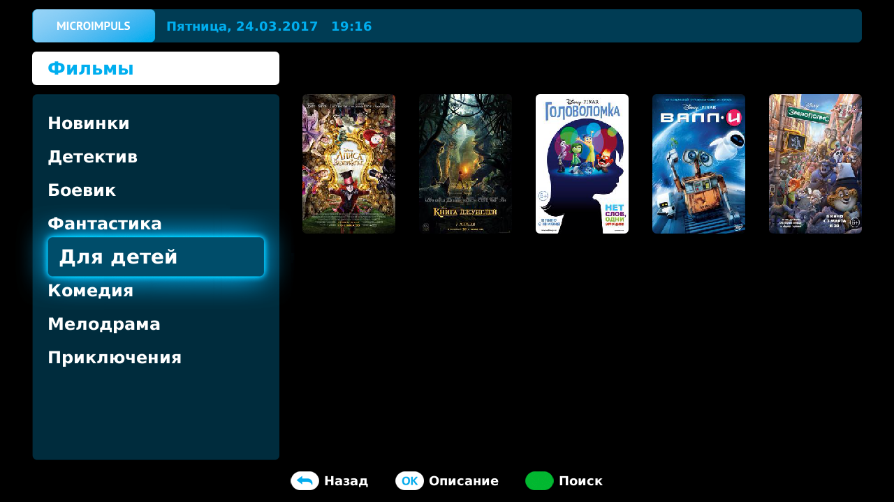
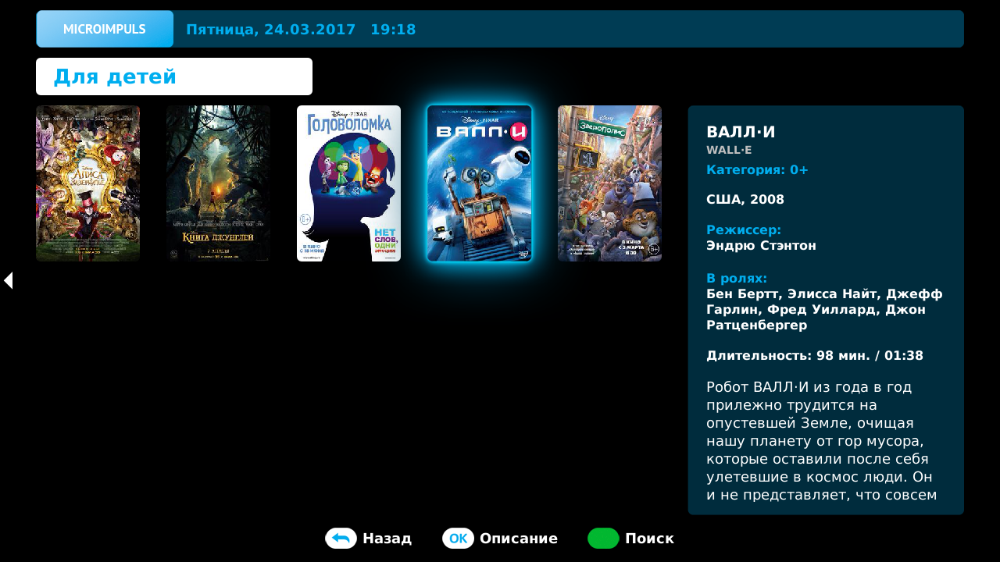
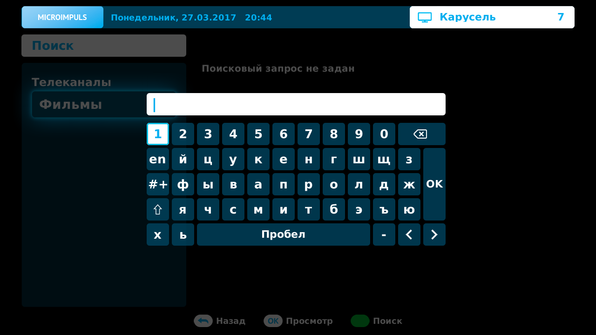
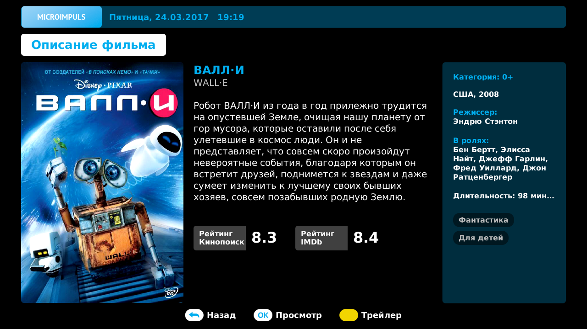
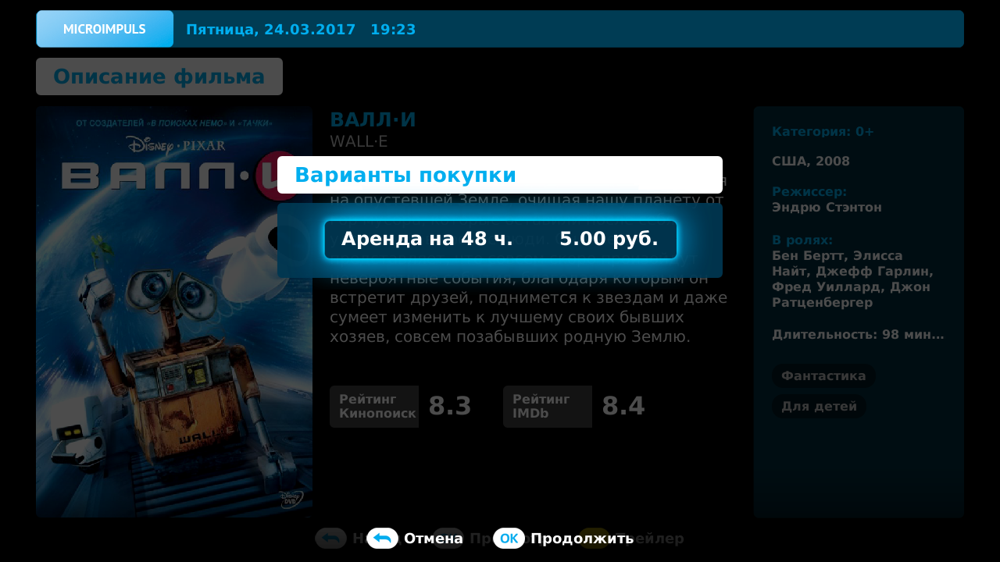
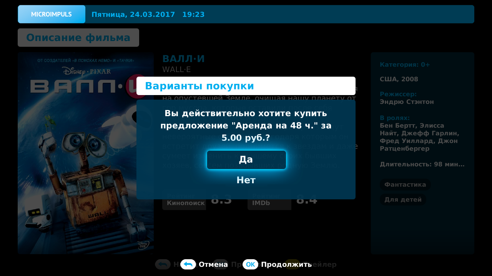
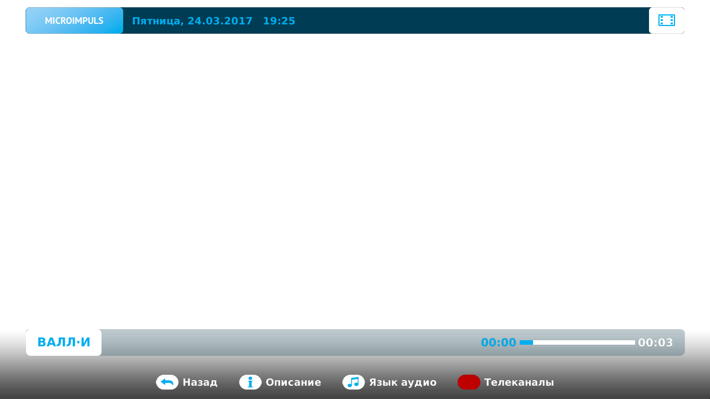

Видеотека
=========

Описание функционала
--------------------

Раздел Видеотека позволяет купить фильмы, мультфильмы и прочее видео, которые затем будут доступны для просмотра в течение всего времени аренды. Так же предусмотрена возможность просмотра трейлера.

Доступные действия в Видеотеке:

* Просмотр списка фильмов
* Просмотр информации о фильме
* Просмотр трейлера фильма
* Покупка фильма в прокат
* Просмотр фильма
* Поиск фильма по названию

Выбор фильма, просмотр трейлера
-------------------------------

Выбрать фильм можно в экране каталога фильмов, либо воспользовавшись функцией Поиск.

Экран каталога фильмов состоит из списка жанров, списка видео и блока с информацией о выбранном видео. Все фильмы в этом экране разбиты по жанрам, список которых находится в левой части. Для навигация по списку жанров используются кнопки **ВВЕРХ/ВНИЗ**.

Для того, чтобы перейти от выбора жанра к выбору фильма нажмите **ОК**, либо кнопку **ВПРАВО**.

Для навигации по списку видео используются кнопки **ВВЕРХ/ВНИЗ/ВПРАВО/ВЛЕВО**, при этом в блоке информации о видео содержатся данные о текущем выбранном фильме. Так же используются кнопки **ПЕРЕМОТКИ ВПЕРЕД/НАЗАД** для перехода вперед/назад на n-элементов, где n — это количество отображаемых на экране видео.

Чтобы выбрать фильм с помощью функции Поиск, нажмите **ЗЕЛЕНУЮ КНОПКУ**. Убедитесь, что в экране поиска в левом меню выбран пункт Фильмы.

Если на экране еще не появилась виртуальная клавиатура с полем ввода - нажмите **ЗЕЛЕНУЮ КНОПКУ** и введите поисковый запрос. Поиск осуществляется по названию фильма. Для того, чтобы перейти к выбору фильма нажмите **ОК**, либо кнопку **ВПРАВО**.

Навигация по списку фильмов в результатах поиска совпадает со списком видео в Видеотеке.

Для просмотра видео или его трейлера необходимо сначала перейти к экрану подробного описания, для этого выберите понравившийся фильм и нажмите кнопку **ОК**.

В экране подробного описания видео чтобы просмотреть его трейлер нажмите **ЖЕЛТУЮ КНОПКУ**.

По окончании трейлера произойдет автоматический переход в экран подробного описания фильма.

Чтобы запустить просмотр фильма его необходимо сначала купить, как это сделать см. :ref:`movie-purchase-label`.

.. _movie-purchase-label:

Покупка фильма
--------------

Для покупки фильма зайдите в экран описания видео и нажмите **ОК**.

На экране появится меню с вариантами покупки, где у каждого варианта будут указаны срок аренды и ее стоимость. Выберите подходящий вариант кнопками **ВВЕРХ/ВНИЗ** и нажмите **ОК**.

После этого появится окно подтверждения покупки, в случае согласия выберите "Да", в противном случае выберите "Нет", либо нажмите кнопку **BACK** или **EXIT**.

В зависимости от настроек ограничения доступа к покупке контента (см. :ref:`parent-control-label`) следующего этапа может либо не быть, либо возможны варианты:

* подтверждение покупки вводом ПИН-кода
* вывод сообщения о запрете покупки, в этом случае операция не будет совершена

При успешном завершении покупки произойдет переход в полноэкранный режим просмотра и начнется воспроизведение видео.

По окончании фильма произойдет автоматический переход в экран его подробного описания.

Просмотр фильма, действия при просмотре
---------------------------------------

При просмотре фильма доступны те же действия, что и при просмотре архивной передачи см. :ref:`actions-in-timeshift-label`, за исключением того, что в данном случае кнопка **INFO** открывает экран подробного описания фильма.